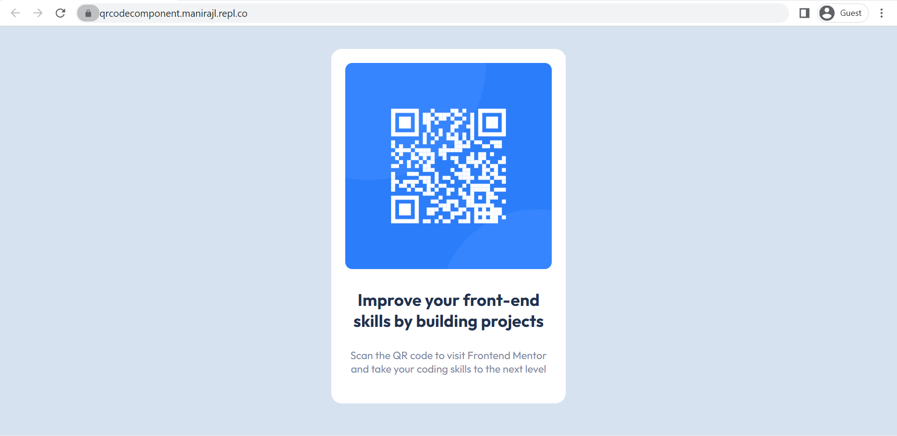

# QR_code_component
QR code component challenge solution

This is a solution to the [QR code component challenge on Frontend Mentor](https://www.frontendmentor.io/challenges/qr-code-component-iux_sIO_H). 

## Table of contents

- [Overview](#overview)
  - [Screenshot](#screenshot)
  - [Links](#links)
- [My process](#my-process)
  - [Built with](#built-with)
- [Author](#author)

## Overview
  Its a QR code component banner creation challenge resembling the given template.
  
### Screenshot
  

### Links

- Solution URL:(https://qrcodecomponent.manirajl.repl.co/)

## My Process
### Built with

- Semantic HTML5 markup
- CSS custom properties
- 
## Author

- Frontend Mentor - [ManirajLakshmanan](https://www.frontendmentor.io/profile/ManirajLakshmanan)

